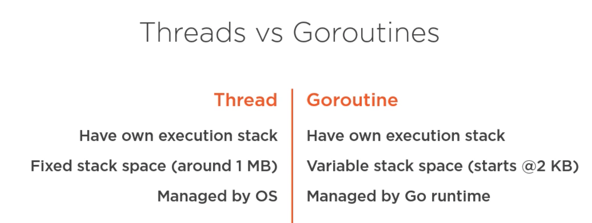

# Go Concurrency

## Threads vs Goroutines

A **thread** represents the ability for the operating system to run a task. Typical operating systems can often have thousands of threads active at a single time. Each one of those threads represents something that the operating system can be working on. It's not working on them all all of the time, but it is a task that *can* be operated on when it needs to be. 
* They have their own execution stack 
    * has its own memory
    * has its own call stack
* Typically have a fixed stack space (~ 1 MB)
    * fixed by the operating system when the thread gets created
    * if they need to do larger memory operations, they use the `Heap Space` in order to manage that.
* Managed directly by the operating system
    * OS will generate a thread and give that to your program

A **Goroutine**
* Has a variable stack space (starting at ~2 KB)
* Has the ability to increase its stack space to take on more and more local operations as needed. 
* Is generally more memory efficient than threads are, but with some overhead associated to manage stack space
* Is managed by the go runtime
    * Go has threads as well, but manages the mapping of the goroutines onto the operating system threads for you.
    * Allows you to create many more goroutines than threads 
    * The runtime provides an interface allowing a relatively small number of threads to work with all of those goroutines. And then the runtime schedules those goroutines onto the threads as they have things to do.